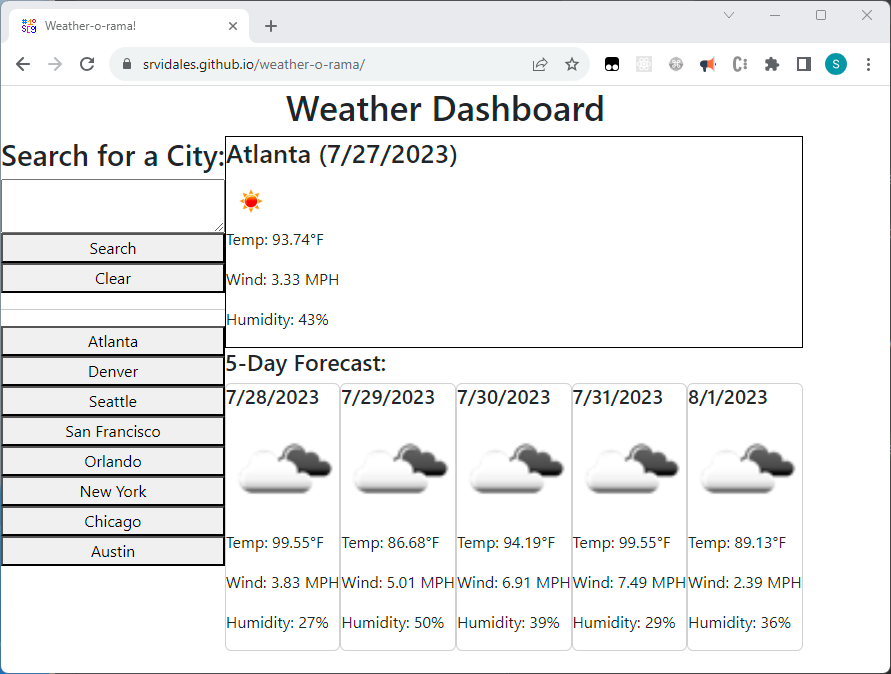

# 06 Server-Side APIs: Weather-o-rama!

This is the solution to the UC Berkeley Extensions coding boot camp module 6 challenge. Yes! We made it!
The challenge itself can be
found [here](https://courses.bootcampspot.com/courses/3826/assignments/57165?module_item_id=1005571)
and [here](https://git.bootcampcontent.com/University-of-California---Berkeley/UCB-VIRT-FSF-PT-06-2023-U-LOLC/-/tree/main/06-Server-Side-APIs/02-Challenge).

## Table of Contents

- [About](#about)
- [Getting Started](#getting-started)
- [Installing](#installing)
- [Usage](#usage)
- [Screenshot](#screenshot)
- [Contributing](#contributing)

## About

The purpose of this challenge is to familiarize the student with calling server-side APIs.
This work encompasses researching the documentation provided by the API, how to use fetch, how to work with promises,
how to pass parameters and values to the API, etc.

## Getting Started

These instructions will get you a copy of the project up and running on your local machine for development and testing
purposes.

```bash
git clone git@github.com:srvidales/weather-o-rama.git
```

## Installing

No installation required.

## Usage

Open the [page](https://srvidales.github.io/weather-o-rama/) in your favorite browser.
Enter a city name in the text area and click on search.
The current weather information will be displayed on the right and a 5 day-weather forecast will be displayed on the right at the bottom.

## Screenshot

Screenshot can be found here: https://github.com/srvidales/weather-o-rama/blob/main/screenshot.png



## Contributing

- Sergio Vidales Perez <srvidales@gmail.com>
